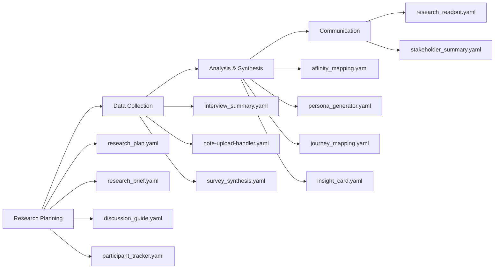

# 🧠 Qori YAML Template Library

Welcome to the Qori template system — a structured, AI-powered way to accelerate research, synthesis, and sharing directly from Slack.

These YAML files define how Qori interprets user input, prompts the AI, and returns structured outputs for your research operations.

---

## 🧩 What Are YAML Templates?

Each YAML file represents a **research tool or task**, like:

- **Planning**: Research plans, briefs, discussion guides
- **Data Collection**: Interview summaries, note processing, survey synthesis
- **Analysis**: Affinity mapping, persona generation, journey mapping
- **Insights**: Jobs-to-be-done analysis, insight cards, opportunity generation  
- **Communication**: Research readouts, stakeholder summaries

Framing: "YAML is not the product — it's how we teach the AI to think like you.
Each file is a research method, not code. You're codifying your craft — once — so everyone can use it."

An analogy:
- YAML = "the script for your research assistant"
- Templates = "modules in your insight factory"
- Slack command = "remote control for a research task"
- Template combinations = "research workflows on autopilot"

---

## 📦 Folder Structure

```text
qori_templates/
│
├─ affinity_mapping.yaml
├─ design_opportunity_generator.yaml
├─ discussion_guide.yaml
├─ insight_card.yaml
├─ interview_summary.yaml
├─ jobs_to_be_done.yaml
├─ journey_mapping.yaml
├─ note-upload-handler.yaml
├─ observer_guide.yaml
├─ participant_outreach.yaml
├─ participant_tracker.yaml
├─ persona_generator.yaml
├─ research_brief.yaml
├─ research_plan.yaml
├─ research_readout.yaml
├─ stakeholder_summary.yaml
├─ survey_synthesis.yaml
├─ usability_issues_extractor.yaml
```

---

## 🔧 YAML Template Anatomy

Each YAML file contains:

```yaml
id: internal_id
label: Human-friendly name with emoji
description: What this template does
input_type: text | file
input_processing: summarize_if_long (optional)
batch_mode: true (optional)
batch_delimiter: "---" (optional)

prompt: |
  The instructions given to the AI. Can include formatting rules, constraints, tone, etc.

output_format: |
  A structured Markdown-style output that AI should return
```

---

## 🤖 How It Works in Slack

1. 🔁 Researcher runs a command like:
   ```
   /qori run-template
   ```
2. 🧠 Qori uses the corresponding YAML file (`interview_summary.yaml`)
3. ✨ The AI processes your input based on the prompt + output_format
4. 📄 The result is posted in your Slack thread **and** saved to GitHub

---

## 🔍 Template Categories & User Journey

### 🎯 Research Planning Phase

| Template                        | Use When...                                               | Journey Stage |
|--------------------------------|------------------------------------------------------------|---------------|
| `research_plan.yaml`           | Create a comprehensive research plan with timeline, roles, goals | **Planning** - Before research begins |
| `research_brief.yaml`          | Draft a concise scoping brief with hypotheses and framing questions | **Planning** - Project kickoff |
| `discussion_guide.yaml`        | Generate a structured interview or session guide | **Planning** - Before data collection |
| `observer_guide.yaml`          | Create guidelines for research observers | **Planning** - Before moderated sessions |
| `participant_outreach.yaml`    | Draft recruitment messaging and outreach content | **Planning** - Participant recruitment |
| `participant_tracker.yaml`     | Create a table for managing participant scheduling and notes | **Planning** - Participant management |

### 📊 Data Collection & Processing

| Template                        | Use When...                                               | Journey Stage |
|--------------------------------|------------------------------------------------------------|---------------|
| `interview_summary.yaml`       | You have raw transcripts to summarize | **Analysis** - After interviews |
| `note-upload-handler.yaml`     | Process and organize uploaded research notes | **Analysis** - Data organization |
| `survey_synthesis.yaml`        | Extract insights from open-ended survey responses | **Analysis** - After surveys |
| `usability_issues_extractor.yaml`| Log usability issues with structured format | **Analysis** - After usability testing |

### 🧠 Synthesis & Insight Generation

| Template                        | Use When...                                               | Journey Stage |
|--------------------------------|------------------------------------------------------------|---------------|
| `affinity_mapping.yaml`        | Group quotes or observations into themes | **Synthesis** - Pattern identification |
| `persona_generator.yaml`       | Generate draft personas from research data | **Synthesis** - User modeling |
| `journey_mapping.yaml`         | Create text-based journey maps (up to 9 steps) | **Synthesis** - Experience mapping |
| `jobs_to_be_done.yaml`         | Map user goals and barriers | **Synthesis** - Needs analysis |
| `insight_card.yaml`            | Capture one key insight with supporting quote and recommendation | **Synthesis** - Insight documentation |
| `design_opportunity_generator.yaml`| Generate "How Might We" prompts from insights | **Synthesis** - Opportunity identification |

### 📈 Communication & Sharing

| Template                        | Use When...                                               | Journey Stage |
|--------------------------------|------------------------------------------------------------|---------------|
| `research_readout.yaml`        | Generate a comprehensive usability readout with quotes, findings, and next steps | **Communication** - Formal reporting |
| `stakeholder_summary.yaml`     | Create a TL;DR for busy stakeholders | **Communication** - Executive updates |

---

## 🔄 Research Workflow & Template Flow

### Typical Research Journey


### Common Template Combinations

**📋 Full Research Project:**
1. `research_plan.yaml` → Plan the study
2. `discussion_guide.yaml` → Create interview guide  
3. `participant_tracker.yaml` → Manage participants
4. `interview_summary.yaml` → Summarize each session
5. `affinity_mapping.yaml` → Group insights
6. `persona_generator.yaml` → Create user personas
7. `research_readout.yaml` → Final report

**🚀 Quick Insight Generation:**
1. `note-upload-handler.yaml` → Process raw notes
2. `insight_card.yaml` → Extract key insights
3. `stakeholder_summary.yaml` → Share findings

**🎯 Design Opportunity Focus:**
1. `jobs_to_be_done.yaml` → Map user needs
2. `journey_mapping.yaml` → Understand experience
3. `design_opportunity_generator.yaml` → Generate ideas

---

## 💡 Best Practices & Tips

### 🎯 Template Selection Guide

**Starting a new project?**
- Begin with `research_plan.yaml` for comprehensive planning
- Use `research_brief.yaml` for quick project scoping
- Set up `participant_tracker.yaml` early for recruitment management

**Processing raw data?**
- Use `note-upload-handler.yaml` for organizing loose notes
- Apply `interview_summary.yaml` to each transcript individually
- Try `survey_synthesis.yaml` for open-ended survey responses

**Need quick insights?**
- `insight_card.yaml` for single, focused insights
- `stakeholder_summary.yaml` for executive communications
- `affinity_mapping.yaml` for pattern identification

**Building user understanding?**
- `persona_generator.yaml` for user archetypes
- `journey_mapping.yaml` for experience flows
- `jobs_to_be_done.yaml` for needs analysis

### 🔧 Template Optimization Tips

1. **Chain Templates**: Use outputs from one template as inputs to another
2. **Batch Processing**: Some templates support batch mode for multiple inputs
3. **Iterative Refinement**: Re-run templates with refined inputs for better results
4. **Context Matters**: Provide rich context in your inputs for better AI outputs
5. **Customize Prompts**: Templates are starting points—modify them for your needs

### 🚫 Common Pitfalls to Avoid

- **Don't skip planning templates** - They save time downstream
- **Don't use synthesis templates on raw data** - Process data first
- **Don't forget stakeholder templates** - Communication is key
- **Don't use the wrong template for your data type** - Match input to purpose

---
