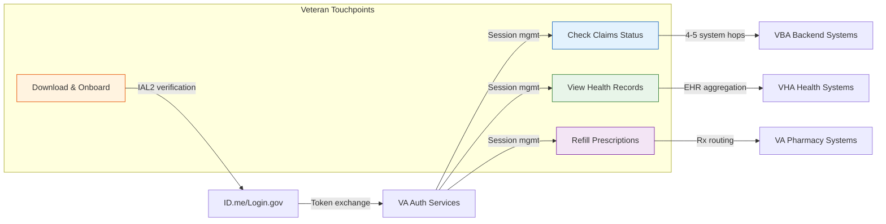
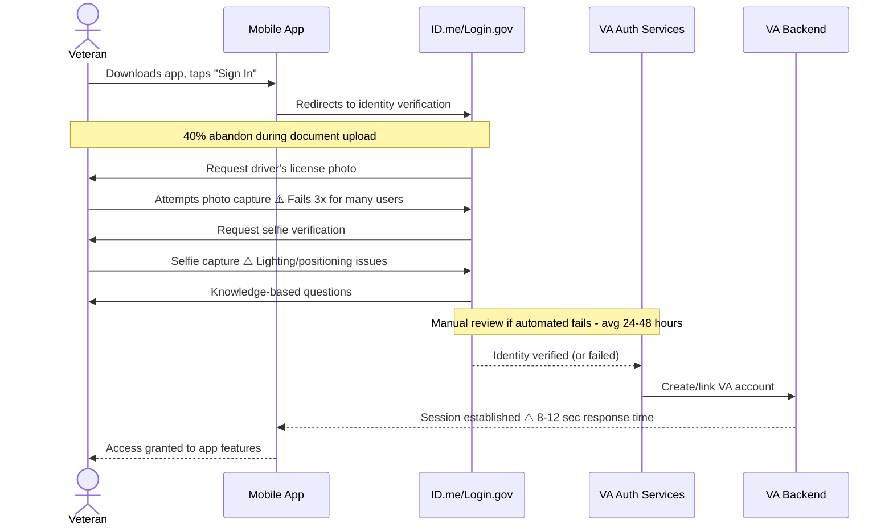
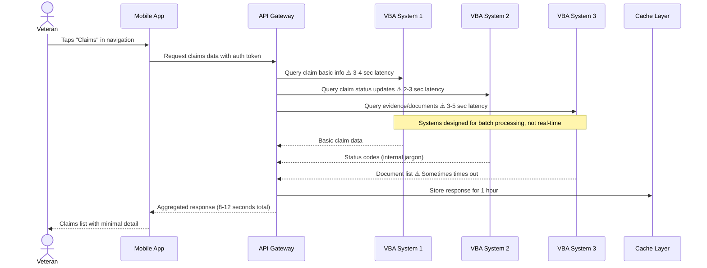
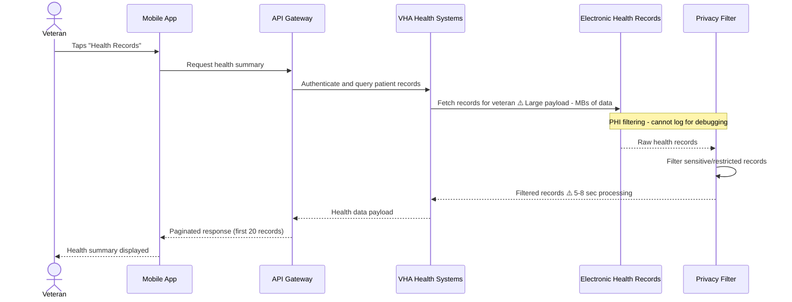
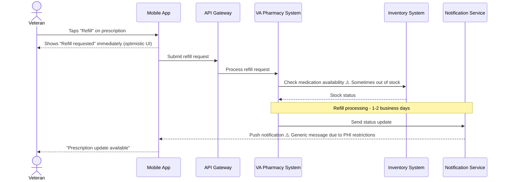

# 🏛️ Stakeholder Synthesis: VA Health and Benefits Mobile App

> **Generated:** January 2026 | **3 stakeholders** | **Policy, Engineering, Design**

---

## Overview

| | |
|---|---|
| **Stakeholders Interviewed** | 3 |
| **Teams Represented** | Policy & Compliance, Engineering, Design |
| **Key Constraint** | Backend API latency (8-12 seconds average response time) |
| **Key Insight** | Mobile app constrained by systems designed for desktop/batch processing |
| **Critical Gap** | 12 engineers supporting 2+ million veterans with no control over backend performance |

---

## Stakeholders Interviewed

| Role | Team | Tenure | Focus Areas |
|------|------|--------|-------------|
| Policy SME | VA Office of Information Security & Privacy | 7 years at VA | HIPAA compliance, Section 508, authentication policy, consent frameworks |
| Engineering Lead | VA Mobile App Team | 4 years at VA | Mobile architecture, API integration, performance optimization, accessibility |
| Design Lead | VA Mobile Experience Team | 3 years at VA | Information architecture, accessibility, design system, veteran experience flows |

---

## 🚧 Constraints & Blockers

### Technical Constraints

> "Our claims status API, for example, aggregates data from multiple VBA systems. Each hop adds latency. By the time the response reaches the app, we're looking at 8-12 seconds on average. Some users on poor connections see 20+ seconds." — Engineering Lead

> "I can design the most beautiful, intuitive interface in the world, but if the data takes 10 seconds to load, the design fails. Loading states, error states, empty states—these aren't edge cases for us, they're primary states." — Design Lead

| Constraint | Impact | Downstream Effect | Source(s) |
|------------|--------|-------------------|-----------|
| Backend API latency (8-12 sec avg, 20+ sec worst case) | Veterans wait extensively for data | App perceived as "slow"; loading spinners become primary experience | Engineering Lead, Design Lead |
| Two native codebases (iOS/Android) | Every feature built twice; 20-30% overhead for accessibility | Delayed feature delivery; platform inconsistencies | Engineering Lead, Design Lead |
| 12 engineers for 2+ million users | Understaffed 3-4x compared to similar consumer apps | Technical debt accumulates; maintenance consumes 20% capacity | Engineering Lead |
| Backend dependency for API changes | 6+ month timeline for simple API enhancements | Can't fix performance issues; must design around limitations | Engineering Lead, Design Lead |

### Policy Constraints

> "Protected Health Information (PHI) is the big one. HIPAA is strict about how PHI can be displayed, transmitted, and stored. On mobile, this creates specific challenges." — Policy SME

> "Session timeout policy is the one I fight most. VA policy requires session timeout after 30 minutes of inactivity for PHI access. I understand the security rationale, but mobile usage patterns are bursty." — Design Lead

| Constraint | Impact | User Experience Effect | Source(s) |
|------------|--------|------------------------|-----------|
| PHI lock screen restrictions | No rich notifications allowed (can't show doctor names, prescription details) | Generic notifications: "You have a new secure message" vs useful previews | Policy SME, Design Lead |
| IAL2 identity verification requirement | Federal mandate for document upload, selfie verification, knowledge questions | Painful onboarding; veterans abandon during verification process | Policy SME, Design Lead |
| 30-minute session timeout | HIPAA Security Rule requirement | Disrupts mobile usage patterns; veterans get logged out mid-task | Policy SME, Design Lead |
| Consent content length | Legal requires full terms visible; no summaries without approval | Screens of legalese; consent fatigue; veterans scroll past without reading | Policy SME, Design Lead |
| Inter-agency coordination (VHA, VBA, ID.me) | Multiple stakeholders must agree on changes | Simple changes take months; competing priorities create feature conflicts | Policy SME, Engineering Lead, Design Lead |

### Resource Constraints

> "We're six designers supporting an app used by over 2 million veterans. For context, a typical tech company would have that many designers for a single feature area." — Design Lead

| Constraint | Impact | Systemic Effect | Source(s) |
|------------|--------|-----------------|-----------|
| 6 designers for 2+ million users | Can't do proper discovery → testing → iteration process | Assumptions-based design; no time for usability testing (4-6 week wait) | Design Lead |
| Federal hiring process delays | 6+ months to fill engineering positions | Good engineers get other offers faster; team stays understaffed | Engineering Lead |
| Research capacity shared across VA properties | 4-6 week wait for usability testing | Ship features without user validation; find problems after launch | Design Lead |
| Approval process (security, privacy, accessibility reviews) | "Quick" fixes take weeks, not days | Can't respond rapidly to user issues; release cycles constrained | Engineering Lead, Policy SME |

---

## 🎯 Strategic Priorities

> "My job is risk mitigation. A privacy breach affecting veterans would be catastrophic—not just legally, but for veteran trust in VA." — Policy SME

> "We're twelve engineers supporting two platforms, multiple feature areas, and an app used by millions of veterans. For context, a comparably complex consumer app would have 3-4x the engineering headcount." — Engineering Lead

| Priority | Driver | Timeline | Aligns With User Needs? | Source |
|----------|--------|----------|:-----------------------:|--------|
| Zero out accessibility bugs | Section 508 compliance; legal risk | Next quarter | ✅ | Engineering Lead |
| Backend API improvements | 8-12 second response times hurting UX | VBA/VHA roadmap dependent | ✅ | Engineering Lead |
| Privacy/security compliance | HIPAA, federal requirements | Ongoing | ⚠️ | Policy SME |
| Technical debt reduction | 20% capacity tax from 2021 launch decisions | Competes with features | ⚠️ | Engineering Lead |
| Design system mobile optimization | VADS built web-first, mobile afterthought | Lengthy approval process | ✅ | Design Lead |
| Identity verification improvements | IAL2 federal requirement, mobile not optimized | ID.me/Login.gov roadmap | ✅ | Policy SME |

**Critical Alignment Gap:** Security and compliance priorities often conflict with user experience needs. Veterans want fast, convenient access, but federal requirements mandate friction for protection. The 30-minute session timeout exemplifies this tension—policy-required but disruptive to mobile usage patterns.

---

## ⚙️ Backstage Processes

> This section maps the invisible systems behind each veteran-facing touchpoint. The overview diagram below shows how processes connect; detailed sequence diagrams follow for each.

### System Overview

---

### Identity Verification & Onboarding

> "IAL2 identity verification is driving most of [the onboarding frustration]. The document photography, selfie matching, and knowledge questions are federal requirements for accessing this level of sensitive data." — Policy SME

> "The identity verification flow uses components from ID.me that we can't modify. We've filed issues, but we're dependent on them to fix." — Engineering Lead

**Process Flow:**

**Where It Breaks Down:**

| Failure Point | What Happens | User Experience | Frequency/Severity |
|---------------|--------------|-----------------|-------------------|
| Document photo capture | Camera quality, lighting, positioning issues | Multiple failed attempts, frustration | 40% abandon here |
| Selfie verification | Face matching algorithm failures | "Try again" loops, some never succeed | High - mentioned by all stakeholders |
| Knowledge-based questions | Credit/address history questions fail | Dead end for veterans with limited credit history | Moderate |
| Manual review queue | Automated verification fails, goes to human review | 24-48 hour wait with no status updates | Low frequency, high impact |

> ✅ **Working Pattern — Biometric Re-authentication:** Instead of full credential entry after session timeout, veterans can use Face ID or Touch ID for quick re-entry. This maintains security while reducing friction for returning users.

**Systems Involved:** ID.me, Login.gov, VA Auth Services, VBA account systems, VHA account systems

---

### Claims Status Checking

> "Our claims status API aggregates data from multiple VBA systems. Each hop adds latency. By the time the response reaches the app, we're looking at 8-12 seconds on average." — Engineering Lead

> "What the API gives us is: claim type, filing date, status (one of about 8 values), and sometimes a vague 'steps completed' indicator. That's not enough for veterans who want to understand why their claim is taking six months." — Design Lead

**Process Flow:**

**Where It Breaks Down:**

| Failure Point | What Happens | User Experience | Frequency/Severity |
|---------------|--------------|-----------------|-------------------|
| VBA system latency | Each system adds 2-5 seconds | Long loading times, 8-12 sec average | Every request |
| Document service timeout | VBA3 doesn't respond within timeout window | Claims show without document status | 15-20% of requests |
| Status terminology changes | VBA changes internal codes without notice | Plain language translations break | Periodic, high confusion |
| Cache staleness | Hour-old data shown while veteran expects real-time | Veteran sees outdated status | Constant tension |

> ✅ **Working Pattern — Progressive Loading:** Claims list loads basic info first (2 seconds), then progressively adds status details and documents. Veterans see useful information quickly even while full data loads.

**Systems Involved:** VBA Claims system, VBA Evidence system, VBA Status system, API Gateway, Redis cache

---

### Health Records Access

> "Health records are slow because the data payloads are large. A veteran with decades of VA care has megabytes of records. We've implemented pagination, but the initial load is still heavy." — Engineering Lead

> "We cannot log PHI or PII. That limits debugging. When something goes wrong for a veteran, we can't see the specific data involved—we see anonymized patterns." — Policy SME

**Process Flow:**

**Where It Breaks Down:**

| Failure Point | What Happens | User Experience | Frequency/Severity |
|---------------|--------------|-----------------|-------------------|
| Large payload processing | Decades of records = megabytes of data | Slow initial load, 5-8 seconds | Veterans with long history |
| Privacy filtering overhead | Each record checked for restricted content | Additional processing delay | Every request |
| Pagination complexity | Mobile needs smaller chunks than API provides | Multiple round trips for full data | Ongoing UX friction |
| Debug limitations | PHI cannot be logged when errors occur | Harder to troubleshoot user-specific issues | Impacts support quality |

> ✅ **Working Pattern — Skeleton Screens:** Health records show placeholder cards that fill in as data arrives. Veterans see immediate feedback that data is loading rather than blank screens.

**Systems Involved:** VHA Health systems, Electronic Health Records (EHR), Privacy filtering service, API Gateway

---

### Prescription Refill Process

> "Appointments are actually pretty fast—that's one of our better-performing areas because the scheduling API is more modern." — Engineering Lead

> "When a veteran requests a prescription refill, we show 'Refill requested' instantly, rather than waiting for the API round-trip. If it fails, we surface an error. Failures are rare enough that this improves perceived experience." — Design Lead

**Process Flow:**

**Where It Breaks Down:**

| Failure Point | What Happens | User Experience | Frequency/Severity |
|---------------|--------------|-----------------|-------------------|
| Inventory stock-out | Medication not available at requested pharmacy | Refill denied, veteran must call or wait | 5-10% of requests |
| Notification restrictions | PHI rules prevent specific medication names in push notifications | Generic "update available" messages | All notifications |
| Optimistic UI failure | Refill request fails after showing success | Veteran thinks it worked, later discovers it didn't | <5% but high confusion |
| Processing delays

---

## 🎯 Service Blueprint Implications

> Organizational and perception-layer insights that complement the
> detailed process maps in Backstage Processes above.

### Frontstage ↔ Backstage Disconnect

> Where the user's mental model diverges from the system reality.
> For detailed system flows, see the sequence diagrams in Backstage
> Processes above.

| What the User Experiences | What's Actually Happening | Design Implication |
|---------------------------|---------------------------|-------------------|
| "The app is slow" | 8-12 second API responses from VBA/VHA systems designed for batch processing, not mobile | Loading states are primary experience, not edge case—design must make waiting feel purposeful |
| Simple "check claim status" request | Data aggregated from 4-5 separate VBA systems in real-time | Set expectation that comprehensive information takes time; consider progressive disclosure |
| App randomly logs them out | 30-minute HIPAA-mandated session timeout triggered by mobile usage patterns (check, put down, return later) | Design session warnings and biometric re-auth as core flows, not error recovery |
| Notifications aren't helpful ("You have a new message") | PHI restrictions prevent showing doctor names or appointment details on lock screen | Educate users why privacy-protective notifications serve their interests |
| Onboarding "should be simple" | IAL2 federal identity verification + MFA setup + multiple system authentications | Reframe as "protecting your sensitive data" rather than bureaucratic friction |

### Support Processes Outside the Product

> Organizational processes that keep the product running but aren't
> captured in the technical system flows above.

| Process | Current State | Risk | Affects |
|---------|---------------|------|---------|
| API change requests to VBA/VHA | Ticket-based system; 6+ month timeline for simple enhancements | Mobile team can't fix slow/limited APIs that users blame on the app | All data-heavy features feel broken |
| Accessibility bug triage | Competes with feature work; manual testing time-constrained | Known a11y issues persist; some third-party components (ID.me) unfixable | Veterans with disabilities get degraded experience |
| Legal consent language approval | Full text required; plain language summaries rejected | Veterans experience "consent fatigue" and don't read terms they're agreeing to | Informed consent becomes meaningless checkbox |
| Cross-platform release coordination | iOS App Store review takes days/weeks; Android faster but unpredictable | Can't do simultaneous releases; features stagger between platforms | Inconsistent experience creates support burden |
| Policy interpretation for new features | Each feature reviewed by multiple offices (Privacy, Legal, 508) | "Innovation tax" of weeks added to every release cycle | Team designs around constraints rather than user needs |

### Line of Visibility Gaps

> The most impactful gaps between what users see and what they
> don't — written as design insights, not technical summaries.

| Users Believe | Reality | Opportunity |
|---------------|---------|-------------|
| VA controls the entire app experience | Identity verification, session management, and data availability controlled by external systems (ID.me, Login.gov, VBA/VHA APIs) | Surface when delays/issues are "not VA"—manage attribution of problems |
| More information should be available | Claims API only provides 8 status values; detailed examiner notes and timelines don't exist in accessible form | Design "information roadmap" showing what will be available when, rather than promising what doesn't exist |
| Privacy restrictions are bureaucratic overhead | PHI lock screen limitations protect veterans from spouse/coworker/family seeing sensitive health information | Reframe privacy as protection, not punishment—let veterans understand the trade-offs |
| The app should work like consumer apps | Federal accessibility, security, and privacy requirements add 20-30% development overhead and constrain UX patterns | Set mobile government app expectations, not commercial app expectations |
| Design team controls the experience | Navigation structure based on 2021 API organization; information architecture constrained by backend data structure | Acknowledge when UX issues require backend investment, not just design fixes |

---

## 🔍 Questions for User Research

> Based on stakeholder input, explore these with participants.
> Priority levels: 🔴 Blocking · 🟡 Important · 🟢 Validation

### Blocking Questions (🔴)

> Must answer before making design decisions

| Stakeholder Insight | Research Question | Method |
|---------------------|-------------------|--------|
| Engineering: "80% of slowness is backend latency we can't fix" | What loading experiences feel acceptable vs. frustrating? At what wait time do users abandon? | Usability testing with timed tasks; prototype different loading patterns |
| Design: "Onboarding abandonment driven by identity verification, not app UX" | Where exactly do users drop off in ID.me/Login.gov flows? What would motivate them to persist? | Funnel analysis + user interviews during/after failed onboarding attempts |
| Policy: "IAL2 verification friction is intentional security—users should understand the trade-off" | Do users understand why identity verification is required? Would security framing increase completion? | Concept testing of different onboarding messaging approaches |
| Engineering: "Navigation structure based on API organization, not user mental models" | How do users expect to find claim status, appointments, messages? What's their task-based mental model? | Card sorting + tree testing of information architecture options |

### Important Questions (🟡)

> Address during study — informs but doesn't block

| Stakeholder Insight | Research Question | Method |
|---------------------|-------------------|--------|
| Design: "Veterans want claim details that don't exist in the API" | What specific claim information do users need to feel informed? What would reduce anxiety during long waits? | User interviews + journey mapping of claims experience |
| Policy: "Minimal notifications protect privacy but users find them useless" | Would users opt into richer notifications if they understood privacy trade-offs? How would they want to control this? | Concept testing of notification privacy controls |
| Engineering: "Accessibility bugs compete with feature work for priority" | How do accessibility issues actually impact veterans with disabilities using the app? | Usability testing with assistive technology users |
| Design: "Session timeout disrupts mobile usage patterns" | How do users actually use the app throughout the day? What's the impact of forced re-authentication? | Diary study of natural app usage patterns |
| Policy: "Consent screens cause fatigue but legal won't approve summaries" | What consent information do users actually want to know? What feels like important vs. legal boilerplate? | Content testing of consent language variations |

### Assumption Validation (🟢)

> Test stakeholder assumptions with real users

| Stakeholder Assumption | Validate With Users |
|------------------------|---------------------|
| Policy: "Veterans appreciate privacy protections once they understand them" | Do users value PHI protection in notifications, or do they prioritize convenience? |
| Design: "Progressive loading makes long waits feel better" | Compare user satisfaction with skeleton screens vs. simple spinners vs. progress indicators |
| Engineering: "Biometric re-auth after timeout is good compromise between security and UX" | How do users experience biometric re-auth? Is it seen as helpful or another barrier? |
| Policy: "Veterans would accept longer onboarding if they understood it prevents fraud" | Does security-focused messaging improve onboarding completion vs. convenience-focused messaging? |
| Design: "Cross-platform compromises are invisible to users" | Do users notice navigation/interaction differences from platform conventions? Does it matter? |
| Engineering: "Users blame the app for backend API problems" | What do users attribute slow performance to? Do they distinguish between app vs. system issues? |

---

## ❓ Open Questions

> Questions that couldn't be answered — need follow-up interviews or data.
> Priority levels: 🔴 Blocking · 🟡 Important · 🟢 Strategic

### Immediate Follow-Up Needed (🔴)

| Question | Who Might Know | Why It Matters |
|----------|----------------|----------------|
| What specific API response times are veterans experiencing by feature area? | Marcus Johnson (Backend Integration) | Need baseline data to prioritize performance improvements and set realistic expectations |
| How often does manual accessibility testing happen currently? | Priya Sharma (Accessibility Engineering) | Critical for understanding accessibility debt and resource planning |
| What would layered consent proposal need to include for legal approval? | Office of General Counsel | Could significantly improve onboarding experience if achievable |

### Needs Clarification (🟡)

| Question | Who Might Know | Why It Matters |
|----------|----------------|----------------|
| Is there appetite for user research specifically on consent experience? | Dr. Rebecca Okonkwo (Policy SME) | Could provide evidence for policy change proposals |
| What's the timeline for VADS mobile component improvements? | Alicia Torres (VA.gov Design System Lead) | Affects design capability roadmap and resource planning |
| How do VBA and VHA coordinate mobile app priorities? | Product leadership | Understanding governance could reduce competing priority tensions |

### Requires Cross-Team Coordination (🟡)

| Question | Teams Involved | Why It Matters |
|----------|----------------|----------------|
| What would backend API redesign for mobile require? | Engineering, VBA/VHA API teams, Infrastructure | 80% of performance issues stem from backend; need coordinated solution |
| How can navigation be restructured without breaking existing user patterns? | Design, Engineering, Product, Analytics | Major UX improvement opportunity but high technical complexity |
| What's the process for proposing user-controlled privacy settings? | Policy, Legal, Design, Engineering | Could address notification usefulness while maintaining privacy |

---

## 📋 Recommendations

### Immediate Actions (🔴 High Priority)

| Action | Constraint Addressed | Feasibility | Owner |
|--------|---------------------|-------------|-------|
| Audit and fix known accessibility bugs in critical flows | Unlabeled buttons, screen reader issues | ✅ | Engineering + Design |
| Document API response time baselines by feature | Performance expectations, engineering prioritization | ✅ | Engineering |
| Create mobile-specific error message library | Generic error messages confusing veterans | ✅ | Design + Content |

### Near-Term Actions (🟡 Medium Priority)

| Action | Constraint Addressed | Feasibility | Owner |
|--------|---------------------|-------------|-------|
| Pilot layered consent approach with legal approval | Consent fatigue, onboarding abandonment | ⚠️ | Policy + Legal + Design |
| Implement feature-specific consent flows | Reduce upfront consent burden | ⚠️ | Policy + Engineering |
| Create "aspirational design" documentation for API advocacy | Limited claims data, slow backend responses | ✅ | Design + Product |
| Establish regular accessibility testing schedule | Accessibility regression bugs | ⚠️ | Engineering + Design |

### Strategic Actions (🟢 Long-Term)

| Action | Constraint Addressed | Feasibility | Owner |
|--------|---------------------|-------------|-------|
| Advocate for mobile-optimized backend APIs | 8-12 second response times, data structure mismatches | ❌ | Product + Engineering + VBA/VHA |
| Redesign navigation based on user mental models | Navigation confusion, feature discoverability | ⚠️ | Design + Engineering + Product |
| Implement user-controlled privacy settings with proper consent | Notification usefulness vs. privacy | ❌ | Policy + Legal + Design |
| Establish dedicated mobile design system components | Cross-platform compromises, design consistency | ⚠️ | Design + Engineering |

---

## 📚 Methodology

**Framework:** Stakeholder Research Synthesis for Service Design

**Approach:** Aggregated findings from 3 internal stakeholder interviews, organized by constraint type, priority alignment, and backstage process mapping. Cross-referenced insights across Policy, Engineering, and Design perspectives to identify systemic patterns and root causes.

**Key Synthesis Methods:**
- Constraint triangulation (same issue from technical, design, and policy angles)
- Process mapping with failure mode identification
- Design pattern recognition (documenting what works, not just what's broken)
- Priority alignment analysis (stated priorities vs. user needs)
- Open question documentation for follow-up

**Data Sources:**
- Dr. Rebecca Okonkwo, Policy & Compliance SME (55 minutes)
- Tomás Rivera, Engineering Lead (52 minutes)
- Jasmine Oyelaran, Design Lead (49 minutes)

---

## 👥 Recommended Next Interviews

| Name/Role | Team | Focus Area | Priority |
|-----------|------|------------|----------|
| Marcus Johnson | Backend Integration | Specific VBA/VHA API limitations and improvement roadmap | 🔴 |
| Office of General Counsel | Legal | Consent language requirements, liability concerns, approval processes | 🔴 |
| Priya Sharma | Accessibility Engineering | Implementation challenges, testing frequency, remediation priorities | 🔴 |
| VBA Privacy Officer | Benefits Data Governance | Claims data exposure limits, inter-agency coordination | 🟡 |
| Ryan Chen | Content Design | Language constraints, legal terminology, plain language tensions | 🟡 |
| 508 Compliance Office | Accessibility Review | Review process, escalation triggers, compliance requirements | 🟡 |
| ID.me/Login.gov Product Teams | Identity Verification | Mobile optimization roadmap, constraint explanations | 🟡 |
| DevOps Lead | Infrastructure | Deployment constraints, performance infrastructure limitations | 🟢 |
| Alicia Torres | VA.gov Design System | Mobile pattern gaps, component approval process | 🟢 |
| App Beta Program Veterans | User Community | Longitudinal perspective on app changes, detailed feedback patterns | 🟢 |

---

References

This analysis follows established stakeholder research and service design methods:

- **Steve Portigal** — "Interviewing Users" (stakeholder interview techniques)
- **Kim Goodwin** — "Designing for the Digital Age" (stakeholder alignment)
- **Stickdorn & Schneider** — "This Is Service Design Thinking" (backstage process mapping)
- **Kalbach** — "Mapping Experiences" (service blueprint methodology)

---

*Generated by Qori • January 29, 2026*
