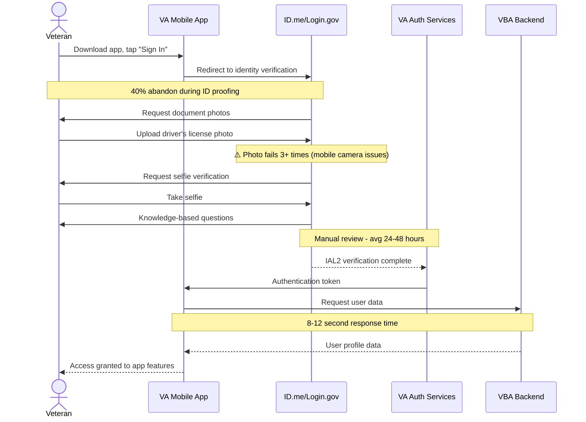
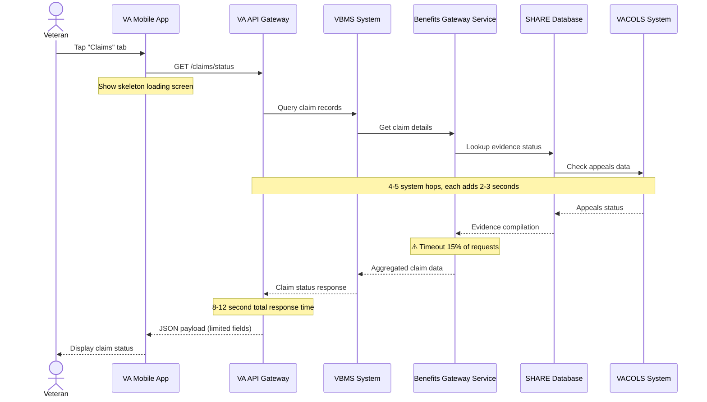
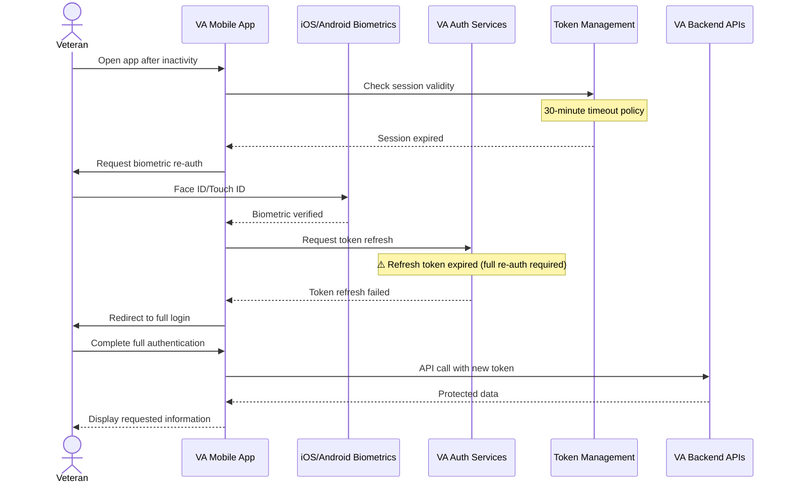
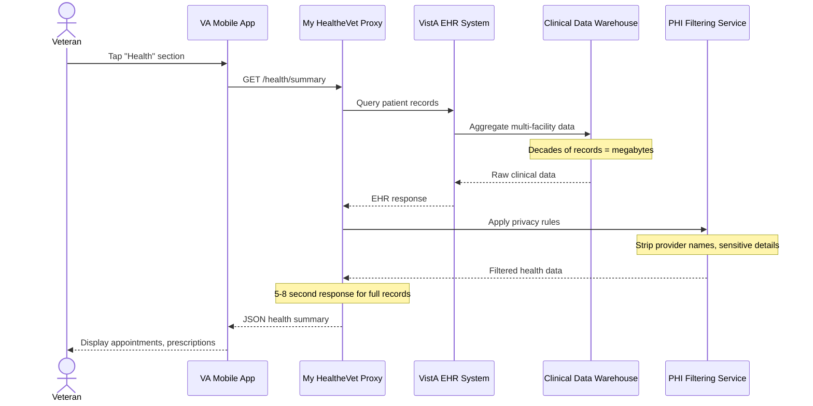

# 🏛️ Stakeholder Synthesis: VA Health and Benefits Mobile App

> **Generated:** January 2026 | **3 stakeholders** | **Policy, Engineering, Design**

---

## Overview

| | |
|---|---|
| **Stakeholders Interviewed** | 3 internal stakeholders |
| **Teams Represented** | Policy & Compliance, Mobile Engineering, Mobile Design |
| **Key Constraint** | Backend API latency (8-12 seconds average response time) |
| **Key Insight** | Mobile app constrained by systems designed for desktop/batch processing |
| **Critical Gap** | No control over backend performance despite owning user experience |

---

## Stakeholders Interviewed

| Role | Team | Tenure | Focus Areas |
|------|------|--------|-------------|
| Policy SME | VA Office of Information Security & Privacy | 7 years at VA | HIPAA compliance, Section 508, authentication policy, consent frameworks |
| Engineering Lead | VA Mobile App Team | 4 years at VA | Mobile architecture, API integration, performance optimization, accessibility |
| Design Lead | VA Mobile Experience Team | 3 years at VA | Information architecture, accessibility, design system, veteran experience flows |

---

## 🚧 Constraints & Blockers

### Technical Constraints

> "Our claims status API aggregates data from multiple VBA systems. Each hop adds latency. By the time the response reaches the app, we're looking at 8-12 seconds on average. Some users on poor connections see 20+ seconds." — Engineering Lead

> "I can design the most beautiful, intuitive interface in the world, but if the data takes 10 seconds to load, the design fails. Loading states, error states, empty states—these aren't edge cases for us, they're primary states." — Design Lead

| Constraint | Impact | Downstream Effect | Source(s) |
|------------|--------|-------------------|-----------|
| Backend API latency (8-12 sec avg, 20+ sec worst case) | Veterans wait extensively for basic data | App perceived as "slow"; loading spinners dominate experience | Engineering Lead, Design Lead |
| Two native codebases (iOS/Android) | Every feature built twice; 20-30% overhead for accessibility | Slower feature delivery; platform inconsistencies | Engineering Lead, Design Lead |
| 12 engineers for 2M+ veterans | Understaffed 3-4x vs comparable consumer apps | 20% capacity spent on maintenance; limited feature development | Engineering Lead |
| VA Design System (VADS) web-first | Mobile patterns are afterthoughts; lengthy approval for new components | Compromised mobile UX; design workarounds | Design Lead |
| Third-party identity components (ID.me) | Can't fix accessibility issues in verification flow | Onboarding accessibility gaps outside VA control | Engineering Lead, Design Lead |

### Policy Constraints

> "Protected Health Information (PHI) is the big one. HIPAA is strict about how PHI can be displayed, transmitted, and stored. Lock screen notifications are a classic example—'Dr. Smith confirmed your Tuesday appointment' contains PHI. The doctor's name reveals the patient-provider relationship." — Policy SME

> "Session timeout policy is the one I fight most. VA policy requires session timeout after 30 minutes of inactivity for PHI access. Mobile usage patterns are bursty—veterans open the app, check something, put it down, come back later." — Design Lead

| Constraint | Impact | User Experience Effect | Source(s) |
|------------|--------|------------------------|-----------|
| PHI lock screen restrictions | No rich notifications allowed | Generic alerts only: "You have a new secure message" vs useful previews | Policy SME, Design Lead |
| IAL2 identity verification requirement | Federal mandate for PHI access | Painful onboarding: document upload, selfie verification, knowledge questions | Policy SME, Engineering Lead, Design Lead |
| 30-minute session timeout | HIPAA Security Rule requirement | Disrupts mobile usage patterns; frequent re-authentication needed | Policy SME, Design Lead |
| Legal consent language requirements | Full terms must be visible; no summaries without approval | Screens of legalese; consent fatigue; veterans scroll past without reading | Policy SME, Design Lead |
| Section 508 accessibility compliance | Non-negotiable federal requirement | 20-30% development overhead; features cannot ship inaccessible | Policy SME, Engineering Lead, Design Lead |
| Inter-agency data governance | VHA, VBA, ID.me have separate policies | Multi-stakeholder approval needed for changes; slow coordination | Policy SME, Engineering Lead |

### Resource Constraints

> "We're six designers supporting an app used by over 2 million veterans. For context, a typical tech company would have that many designers for a single feature area." — Design Lead

| Constraint | Impact | Systemic Effect | Source(s) |
|------------|--------|-----------------|-----------|
| 6 designers for 2M+ veterans | Can't do proper discovery → testing → iteration process | Assumptions-based design; limited research validation | Design Lead |
| Federal hiring process delays | 6 months to fill engineering positions | Understaffing persists; contractor dependency | Engineering Lead |
| Shared research capacity | 4-6 weeks to get usability testing scheduled | Features ship without user validation | Design Lead |
| Backend API dependency | Can't fix slow APIs; changes take 6+ months through tickets | Client-side optimizations hit ceiling; user experience limited by external systems | Engineering Lead, Design Lead |
| Legacy technical debt from 2021 launch | Pandemic pressure created compromises now load-bearing | 20% engineering capacity spent on maintenance; navigation architecture constrains new features | Engineering Lead, Design Lead |

---

## 🎯 Strategic Priorities

> "My job is risk mitigation. A privacy breach affecting veterans would be catastrophic—not just legally, but for veteran trust in VA." — Policy SME

> "Product sees competitor apps with slick features and wants parity. But those apps have 10x our resources and don't have our backend constraints." — Engineering Lead

| Priority | Driver | Timeline | Aligns With User Needs? | Source |
|----------|--------|----------|:-----------------------:|--------|
| Zero out accessibility bugs | Section 508 compliance; legal risk | Next quarter | ✅ | Engineering Lead |
| Backend API performance improvements | 8-12 second response times hurting UX | Dependent on VBA/VHA roadmaps | ✅ | Engineering Lead |
| Privacy/security compliance | HIPAA, federal requirements, veteran trust | Ongoing/non-negotiable | ⚠️ | Policy SME |
| Feature parity with web properties | VHA/VBA stakeholder requests | Ongoing pressure | ❌ | Design Lead |
| Technical debt reduction | 20% capacity tax from 2021 launch decisions | Competes with features | ⚠️ | Engineering Lead |
| Design system mobile optimization | VADS built web-first, mobile afterthought | Slow approval process | ✅ | Design Lead |

**Critical Alignment Gap:** Feature parity requests from VHA/VBA conflict with mobile-first design principles. Veterans want simple, fast mobile experiences, but stakeholders push for comprehensive feature replication from web properties.

---

## ⚙️ Backstage Processes

### Identity Verification & Onboarding

> "IAL2 identity verification is federal policy, not VA choice. The document upload, selfie verification, knowledge-based questions—these are federal requirements for accessing this level of sensitive data." — Policy SME

> "Veterans download the app expecting to check their claim status in 30 seconds. Instead, they face: download → account creation → identity proofing (multiple steps) → MFA setup → waiting for verification → finally, access." — Design Lead

**Process Flow:**



**Where It Breaks Down:**

| Failure Point | What Happens | User Experience | Frequency/Severity |
|---------------|--------------|-----------------|-------------------|
| Document photo capture | Mobile camera quality/positioning issues | Multiple failed attempts, frustration | 40% abandon during ID proofing |
| Manual verification delay | ID.me/Login.gov manual review queue | 24-48 hour wait after completing steps | Standard process |
| Session timeout during onboarding | 30-minute policy kicks in mid-process | Must restart verification | Unknown frequency |
| Backend data load failure | VBA systems timeout or error | Successful auth but no data access | 8-12 second average response |

**Systems Involved:** VA Mobile App, ID.me, Login.gov, VA Auth Services, VBA Backend Systems, VHA Systems

---

### Claims Status Retrieval

> "Our claims status API aggregates data from multiple VBA systems. Each hop adds latency. By the time the response reaches the app, we're looking at 8-12 seconds on average. Some users on poor connections see 20+ seconds." — Engineering Lead

> "What the API gives us is: claim type, filing date, status (one of about 8 values), and sometimes a vague 'steps completed' indicator. That's not enough for veterans who want to understand why their claim is taking six months." — Design Lead

**Process Flow:**



**Where It Breaks Down:**

| Failure Point | What Happens | User Experience | Frequency/Severity |
|---------------|--------------|-----------------|-------------------|
| BGS timeout | Benefits Gateway Service fails to respond | "Unable to load claims" error | 15% of requests |
| Multiple system latency | Each system hop adds 2-3 seconds | 8-12 second wait minimum | Every request |
| Limited API data | Only basic status fields returned | Vague status like "Pending Decision Approval" | All responses |
| Status terminology changes | VBA changes internal terms without notice | Plain language translations break | Periodic |

**Systems Involved:** VA Mobile App, VA API Gateway, VBMS, Benefits Gateway Service (BGS), SHARE Database, VACOLS System

---

### Session Management & Authentication

> "HIPAA Security Rule requires safeguards against unauthorized access. Session timeout after inactivity is a standard safeguard. VA policy is 30 minutes of inactivity." — Policy SME

> "The authentication layer is complex. We support Login.gov and ID.me, each with their own token management. Refresh flows, session extension, biometric re-authentication—there's a lot of state to manage." — Engineering Lead

**Process Flow:**



**Where It Breaks Down:**

| Failure Point | What Happens | User Experience | Frequency/Severity |
|---------------|--------------|-----------------|-------------------|
| 30-minute timeout | Session expires during mobile usage gaps | Must re-authenticate frequently | Policy-mandated |
| Biometric failure | Face ID/Touch ID doesn't work | Full credential re-entry required | ~10% of attempts |
| Refresh token expiration | Token can't be refreshed silently | Unexpected logout, full re-auth | Most common support ticket |
| Mid-task timeout | Session expires during form completion | Lost form data, must restart | Unknown frequency |

**Systems Involved:** VA Mobile App, iOS/Android Biometric Systems, VA Auth Services, Token Management System, ID.me, Login.gov

---

### Health Data Retrieval

> "Health records are slow because the data payloads are large. A veteran with decades of VA care has megabytes of records. We've implemented pagination, but the initial load is still heavy." — Engineering Lead

> "Session display was debated extensively. Should the app show the names of previous session attendees? If a veteran had a mental health appointment, displaying the therapist's name next to the session could reveal the nature of care." — Policy SME

**Process Flow:**



**Where It Breaks Down:**

| Failure Point | What Happens | User Experience | Frequency/Severity |
|---------------|--------------|-----------------|-------------------|
| Large payload size | Megabytes of historical data | 5-8 second initial load | Veterans with long history |
| Multi-facility aggregation | CDW must query multiple VistA instances | Extended response times | Multi-facility veterans |
| PHI filtering overhead | Privacy rules applied to every field | Additional processing delay | Every request |
| VistA system variability | Different facilities have different VistA versions | Inconsistent data formats | Facility-dependent |

**Systems Involved:** VA Mobile App, My HealtheVet Proxy, VistA EHR Systems, Clinical Data Warehouse (CDW), PHI Filtering Service

---

### Prescription Refill Process

> "We use background refresh to update cached data when the app isn't in use. We batch API calls where possible." — Engineering Lead

> "Optimistic UI shows success immediately for actions, confirming in the background. When a veteran requests a prescription refill, we show 'Refill requested' instantly, rather than waiting for the API round-trip." — Design Lead

**Process Flow:**

```mermaid
sequenceDiagram
    actor Veteran
    participant MobileApp as VA Mobile App
    participant RxAPI as Prescription API
    participant CMOP as CMOP System
    participant Pharmacy as VA Pharmacy
    participant NotificationSvc as Notification Service
    
    Veteran->>MobileApp: Tap "Refill" on prescription
    MobileApp-->>Veteran: Show "Refill requested" immediately
    Note over

---

## 🎯 Service Blueprint Implications

> Key inputs for backstage/support layer mapping

### Frontstage Moments That Depend on Fragile Backstage

| Frontstage Moment | Backstage Dependency | Failure Mode |
|-------------------|----------------------|--------------|
| User taps "Check Claim Status" | 4-5 VBA systems must respond + aggregate data | 8-12 second wait, timeouts create "app is broken" perception |
| User completes identity verification | ID.me/Login.gov systems + VA token exchange + IAL2 validation | Multi-step failures with generic error messages; users blame VA app |
| User receives push notification | PHI filtering + notification service + device delivery | Notifications so generic ("You have a message") they're not actionable |
| User tries to refill prescription | VHA prescription system + inventory check + pharmacy routing | Optimistic UI shows "requested" but backend failure invisible until later |
| User session expires after 30min | HIPAA timeout policy + biometric re-auth + token refresh | Appears as "app logged me out randomly" - policy invisible to user |
| User takes screenshot of health data | Screen recording protection + PHI exposure warnings | No clear feedback about privacy implications of sharing screenshots |

### Support Processes Currently Manual

| Process | Current State | Risk |
|---------|---------------|------|
| API change requests to VHA/VBA | Engineering submits tickets, waits 6+ months for prioritization | Mobile team can't fix user-reported data issues; appears unresponsive |
| Accessibility bug remediation | Manual testing finds issues competing with feature work | Known a11y problems persist; Section 508 compliance at risk |
| Cross-platform release coordination | iOS App Store (days) vs Google Play (hours) review cycles | Staggered releases create user confusion about feature availability |
| Claims terminology translation | Manual mapping when VBA changes internal terms without notice | Plain language translations break; users see jargon unexpectedly |
| Third-party component accessibility | Filing issues with ID.me for unlabeled elements; waiting for fixes | Identity verification flow has a11y gaps VA can't directly resolve |
| Performance issue diagnosis | Tracing problems across mobile → API gateway → multiple backends | Root cause analysis takes days; users experience "slowness" without resolution timeline |

### Line of Visibility Gaps

| Users See | Users Don't See | Creates Confusion When... |
|-----------|-----------------|---------------------------|
| "Loading..." for 12 seconds | Claims data aggregating from 4-5 separate VBA systems | Users think app is broken, not that backend is complex |
| Generic error: "Something went wrong" | Specific API failures, authentication token issues, system timeouts | Users can't troubleshoot or understand if problem is temporary |
| Session timeout after 30 minutes | HIPAA Security Rule requirement driving policy | Feels like arbitrary app limitation, not security protection |
| Minimal lock screen notifications | PHI privacy protection preventing rich content | Notifications seem useless compared to other apps |
| Identity verification steps | IAL2 federal requirement for PHI access | Onboarding feels like VA bureaucracy, not security necessity |
| Features missing on one platform | Engineering building everything twice; iOS/Android divergence | Users assume VA doesn't care about their platform |

---

## 🔍 Questions for User Research

> Based on stakeholder input, explore these with participants

### High Priority (🔴)

| Stakeholder Insight | Research Question | Method |
|---------------------|-------------------|--------|
| Policy: "Veterans want rich notifications but PHI can't appear on lock screen" | How do veterans currently use notifications? What information do they want vs. need? Would they accept privacy trade-offs for convenience? | **Diary study** + contextual interviews about notification usage patterns |
| Engineering: "80% of 'slowness' is backend latency we can't fix" | Which specific delays feel most frustrating? Do loading states/skeleton screens actually help perception? | **Usability testing** with performance monitoring; measure perceived vs. actual wait times |
| Design: "Onboarding abandonment driven by identity verification length, not complexity" | At what point do veterans abandon onboarding? What would motivate them to continue through verification? | **Funnel analysis** + exit interviews with veterans who abandoned setup |
| Policy: "Session timeout disrupts mobile usage patterns but can't be extended" | How do veterans actually use the app throughout the day? When do timeouts feel most disruptive? | **Mobile ethnography** tracking app usage patterns over 1-2 weeks |
| Engineering: "Navigation based on API organization, not user mental models" | How do veterans expect health and benefits information to be organized? What's their mental model? | **Card sorting** + tree testing for information architecture |

### Medium Priority (🟡)

| Stakeholder Insight | Research Question | Method |
|---------------------|-------------------|--------|
| Design: "VHA vs VBA competing for home screen prominence" | Do veterans see health and benefits as integrated or separate? How do they prioritize access? | **Journey mapping** across health and benefits tasks |
| Policy: "Consent fatigue - veterans scroll past legal text without reading" | What consent information do veterans actually want to know? How can we make consent meaningful? | **Consent flow usability testing** with comprehension checks |
| Engineering: "Feature flags create navigation complexity for different users" | Do veterans notice inconsistent experiences? How does personalization affect discoverability? | **Comparative testing** of personalized vs. standard navigation |
| Design: "Claims terminology changes without notice, breaking translations" | Do plain language translations actually help understanding? What happens when jargon appears unexpectedly? | **Content testing** comparing technical vs. plain language versions |
| Engineering: "Accessibility bugs compete with feature work for priority" | How do veterans with disabilities experience current accessibility gaps? What's the impact of unlabeled elements? | **Accessibility-focused usability testing** with assistive technology users |

### Validation Questions (🟢)

| Stakeholder Assumption | Validate With Users |
|------------------------|---------------------|
| **Policy**: "Privacy protections support military culture reluctance to share health struggles" | Do veterans actually want health information hidden from family/household members? |
| **Design**: "Veterans abandon onboarding because 'it's taking too long' not 'it's too hard'" | What specific onboarding steps feel excessive vs. necessary to veterans? |
| **Engineering**: "Biometric re-authentication reduces session timeout friction" | Do veterans prefer biometric re-auth to full login after timeout? |
| **Policy**: "Veterans would accept privacy trade-offs for notification convenience if properly informed" | Would veterans opt into richer notifications with clear privacy explanations? |
| **Design**: "Skeleton screens and progressive loading improve perceived performance" | Do loading state improvements actually reduce frustration with slow responses? |
| **Engineering**: "Veterans blame the app for backend system limitations they can't see" | Do veterans understand when problems are VA app vs. VA systems vs. third-party services? |

---

## ❓ Open Questions

> Questions that couldn't be answered — need follow-up interviews or data

### Immediate Follow-Up Needed (🔴)

| Question | Who Might Know | Why It Matters |
|----------|----------------|----------------|
| What would a proper informed consent flow for user-controlled privacy settings look like? | Office of General Counsel | Could unlock richer notifications and reduce privacy friction |
| What's the specific timeline for backend API improvements that would help mobile performance? | Marcus Johnson (Backend Integration) | Engineering team hitting ceiling of client-side optimizations |
| How often does manual accessibility testing actually happen vs. should happen? | Priya Sharma (Accessibility Engineering) | Known a11y bugs competing with feature work |
| What data exists on veteran satisfaction/ease of use beyond app store ratings? | Research/Analytics team | Design team can't prove impact of improvements |

### Needs Policy/Legal Clarification (🟡)

| Question | Who Might Know | Why It Matters |
|----------|----------------|----------------|
| What would it take to get approval for layered consent (summary + full terms)? | Office of General Counsel | Could reduce consent fatigue while maintaining legal protection |
| Is there appetite for mobile-specific policy guidance to supplement desktop-era regulations? | Dr. Rebecca Okonkwo + Policy leadership | Current policies don't fit mobile usage patterns well |
| What's the liability exposure for AI/ML features that make benefit recommendations? | Office of General Counsel | Blocking potential helpful features due to unclear risk |
| Could session timeout be extended with additional security controls (e.g., enhanced biometrics)? | Policy + Security teams | 30-minute timeout disrupts mobile usage patterns |

### Requires Cross-Team Coordination (🟡)

| Question | Teams Involved | Why It Matters |
|----------|----------------|----------------|
| What would it take to restructure navigation based on user mental models vs. API organization? | Design + Engineering + Product | Current structure confusing but changing affects deep linking, analytics, caching |
| How can we better coordinate VHA vs. VBA feature priorities for limited home screen real estate? | Product + VHA + VBA stakeholders | Competing priorities creating cluttered experience |
| What's the process for getting mobile-optimized identity verification flows prioritized by ID.me/Login.gov? | Policy + Product + ID.me/Login.gov | Biggest onboarding friction point outside VA's direct control |

---

## 📋 Recommendations

### Immediate Actions (🔴 High Priority)

| Action | Constraint Addressed | Feasibility | Owner |
|--------|---------------------|-------------|-------|
| Conduct user research specifically on consent experience to build case for legal changes | Consent fatigue, legal language requirements | ✅ | Research Team |
| Create accessibility bug zero-out sprint plan with product buy-in | Known a11y issues competing with features | ⚠️ | Engineering + Product |
| Document and prioritize "aspirational" designs with missing API data requirements | Claims detail limitations, API constraints | ✅ | Design + Product |
| Establish regular cross-platform accessibility testing schedule | Platform-specific a11y bugs slipping through | ✅ | Engineering |

### Near-Term Actions (🟡 Medium Priority)

| Action | Constraint Addressed | Feasibility | Owner |
|--------|---------------------|-------------|-------|
| Pilot layered consent approach with legal approval for specific low-risk features | Consent screen length, legal requirements | ⚠️ | Policy + Legal + Design |
| Create mobile-specific VADS component proposal process with faster approval | Design system gaps, component approval delays | ⚠️ | Design System Team |
| Implement better perceived performance patterns for 10+ second API calls | Backend latency, "slow" user experience | ✅ | Design + Engineering |
| Establish VHA/VBA coordination process for competing mobile feature priorities | Information architecture tensions | ⚠️ | Product + Stakeholders |

### Strategic Actions (🟢 Long-Term)

| Action | Constraint Addressed | Feasibility | Owner |
|--------|---------------------|-------------|-------|
| Advocate for mobile-first API redesign with VBA/VHA backend teams | 8-12 second response times, mobile usage patterns | ❌ | Engineering + Product |
| Propose user-controlled privacy settings with proper informed consent framework | Notification limitations, privacy vs. convenience | ❌ | Policy + Legal |
| Build case for navigation restructure based on user mental models vs. API structure | Navigation confusion, legacy architecture | ❌ | Design + Engineering + Product |
| Develop comprehensive veteran satisfaction measurement system beyond app store ratings | Inability to prove design impact | ⚠️ | Research + Analytics |

---

## 📚 Methodology

**Framework:** Stakeholder Research Synthesis for Service Design

**Approach:** Aggregated findings from 3 internal stakeholder interviews (Policy SME, Engineering Lead, Design Lead), organized by constraint type, priority alignment, and backstage process mapping. Cross-referenced insights across technical, design, and policy perspectives to identify systemic patterns and root causes.

**Key Synthesis Methods:**
- Constraint triangulation (same issues from technical, design, and policy angles)
- Process mapping with failure mode identification  
- Priority alignment analysis (stated priorities vs. user needs)
- Open question documentation for follow-up research

**Data Sources:**
- Dr. Rebecca Okonkwo, Policy & Compliance SME (55 minutes)
- Tomás Rivera, Engineering Lead (52 minutes)  
- Jasmine Oyelaran, Design Lead (49 minutes)

---

## 👥 Recommended Next Interviews

| Name/Role | Team | Focus Area | Priority |
|-----------|------|------------|----------|
| Office of General Counsel | Legal | Consent language approval, liability concerns, AI/ML risk assessment | 🔴 |
| Marcus Johnson | Backend Integration | Specific VBA/VHA API limitations, improvement timelines | 🔴 |
| VBA Privacy Officer | Benefits Data | Claims data governance, exposure limits, terminology changes | 🔴 |
| Priya Sharma | Accessibility Engineering | A11y implementation challenges, testing frequency, mobile patterns | 🟡 |
| Ryan Chen | Content Design | Language constraints, legal terminology, plain language tensions | 🟡 |
| 508 Compliance Office | Accessibility | Review process, escalation triggers, mobile-specific guidance | 🟡 |
| ID.me/Login.gov Product Teams | Identity Verification | Mobile optimization roadmap, VA-specific improvements | 🟡 |
| DevOps Lead | Infrastructure | Deployment constraints, performance infrastructure, monitoring | 🟡 |
| Alicia Torres | VA.gov Design System | Mobile pattern gaps, component approval process | 🟢 |
| Dr. Keisha Williams | Center for Innovation | Cognitive accessibility research, veteran-specific needs | 🟢 |

---

<details>
<summary>References</summary>

This analysis follows established stakeholder research and service design methods:

- **Steve Portigal** — "Interviewing Users" (stakeholder interview techniques)
- **Kim Goodwin** — "Designing for the Digital Age" (stakeholder alignment)
- **Stickdorn & Schneider** — "This Is Service Design Thinking" (backstage process mapping)
- **Kalbach** — "Mapping Experiences" (service blueprint methodology)

</details>

---

*Generated by Qori • January 29, 2026*
