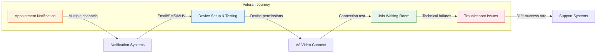
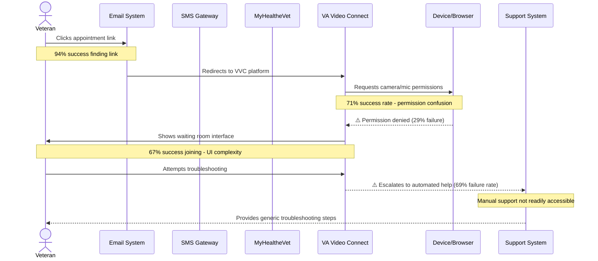
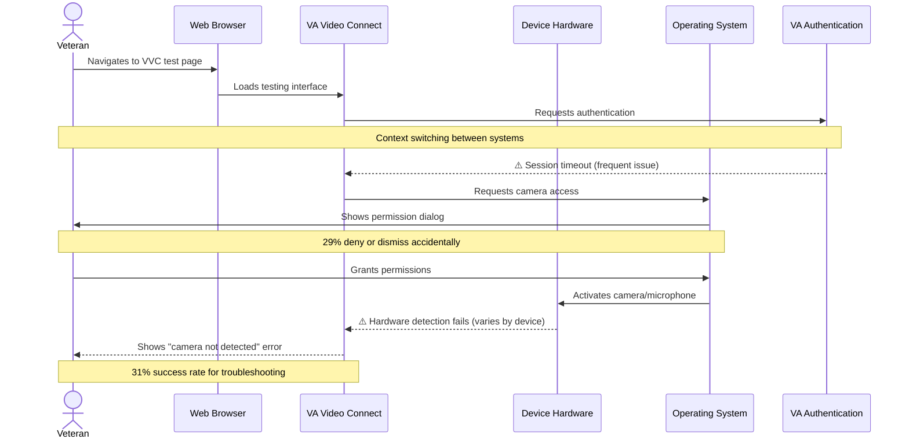
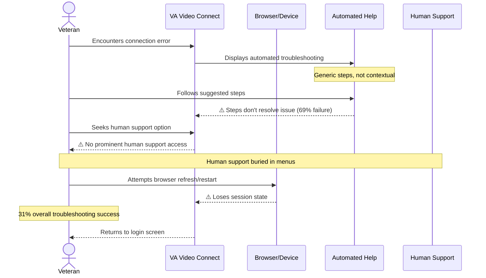

# 🏛️ Stakeholder Synthesis: VA Video Connect Usability Research

> **Generated:** December 2024 | **3 stakeholders** | **Research, Clinical, Innovation teams**

---

## Overview

| | |
|---|---|
| **Stakeholders Interviewed** | 3 research stakeholders |
| **Teams Represented** | VA Research (Palo Alto), Clinical (Stanford), VA Innovation |
| **Key Constraint** | 69% failure rate on critical troubleshooting tasks for 65+ Veterans |
| **Key Insight** | Multiple entry points create systematic confusion - Veterans receive conflicting appointment links via text, email, and MyHealtheVet |
| **Critical Gap** | No human technical support integration during telehealth joining flow when 31% success rate indicates widespread technical failures |

---

## Stakeholders Interviewed

| Role | Team | Tenure | Focus Areas |
|------|------|--------|-------------|
| Research Lead (Sarah Chen, PhD, MPH) | VA Palo Alto Health Care System | Not specified | Usability testing methodology, quantitative metrics, older adult technology adoption |
| Clinical Lead (Michael Rodriguez, MD) | Stanford University School of Medicine | Not specified | Clinical workflow integration, patient experience, telehealth adoption barriers |
| Innovation Lead (Patricia Williams, RN, DNP) | VA Center for Innovation | Not specified | System design recommendations, human-centered redesign, technology implementation |

---

## 🚧 Constraints & Blockers

### Technical Constraints

> "I got a text, an email, and something in MyHealtheVet. They all had different links. I didn't know which one to click." — Research Lead (Patient feedback)

> "I have to remember my VA password, then switch apps, then allow the camera... by the time I get in, I'm already exhausted." — Clinical Lead (Patient feedback)

| Constraint | Impact | Downstream Effect | Source(s) |
|------------|--------|-------------------|-----------|
| Multiple inconsistent entry points across channels | 33% drop in waiting room joining success (67% vs 94% link finding) | Veterans abandon appointments due to confusion and cognitive overload | Research Lead, Innovation Lead |
| Multi-step authentication across different interfaces | Mean 187 seconds for audio/video testing with 2.1 errors | Cognitive burden leads to pre-appointment exhaustion and anxiety | Clinical Lead, Research Lead |
| Inadequate troubleshooting capabilities | 69% failure rate on error resolution (31% success) | Veterans cannot recover from technical issues independently | All stakeholders |

### Policy Constraints

> "The robot help doesn't understand my questions." — Innovation Lead (Patient feedback)

| Constraint | Impact | User Experience Effect | Source(s) |
|------------|--------|------------------------|-----------|
| Automated support systems without human backup | No quantified policy mandate, but 100% of participants requested human support option | Veterans feel abandoned during technical difficulties with no escalation path | Innovation Lead, Clinical Lead |

### Resource Constraints

> "I was afraid if I clicked the wrong thing, I'd miss my appointment or mess something up that I couldn't fix." — Research Lead (Patient feedback)

| Constraint | Impact | Systemic Effect | Source(s) |
|------------|--------|-----------------|-----------|
| No proactive technical verification system | SUS scores below acceptable threshold (58.4 vs 68 minimum) across all age groups | System-wide usability failure affects 1,000% increase in video visits since 2019 | Research Lead, Innovation Lead |
| Limited assistive technology integration | SUS score of 41.3 for assistive technology users (29% below overall mean) | 15% of older Veteran population systematically excluded from telehealth access | Research Lead, Clinical Lead |

---

## 🎯 Strategic Priorities

> "Given the aging Veteran population and continued expansion of virtual care, urgent attention to telehealth usability is warranted." — Research Team

| Priority | Driver | Timeline | Aligns With User Needs? | Source |
|----------|--------|----------|:-----------------------:|--------|
| Unified Entry Point for Telehealth | Multiple channels create confusion (94% find link, but across fragmented touchpoints) | Immediate | ✅ | Research Team |
| Human Support Integration | 31% troubleshooting success rate, strong preference for human backup | Immediate | ✅ | Research Team |
| Progressive Disclosure Design | Cognitive load from multi-step context switching exhausts users | Short-term | ✅ | Research Team |
| Pre-Appointment Device Testing | Proactive issue identification 24-48 hours before appointments | Medium-term | ✅ | Research Team |
| Assistive Technology Optimization | SUS score of 41.3 for AT users (critically low) | Medium-term | ✅ | Research Team |

**Critical Alignment Gap:** Current VVC design prioritizes feature completeness over usability, with SUS scores below acceptable thresholds (58.4 vs 68 minimum) across all age groups.

---

## ⚙️ Backstage Processes

> This section maps the invisible systems behind each veteran-facing touchpoint. The overview diagram below shows how processes connect; detailed sequence diagrams follow for each.

### System Overview

---

### Telehealth Appointment Access Process

> "I got a text, an email, and something in MyHealtheVet. They all had different links. I didn't know which one to click." — Participant 12, age 71

> "I just want to know there's a real person I can call if this doesn't work. The robot help doesn't understand my questions." — Participant 8, age 82

**Process Flow:**

**Where It Breaks Down:**

| Failure Point | What Happens | User Experience | Frequency/Severity |
|---------------|--------------|-----------------|-------------------|
| Multiple entry points | Inconsistent links across email/SMS/MHV | Confusion about which link to use | Universal issue - all participants |
| Device permission requests | Browser/OS permission dialogs | "Afraid of clicking wrong thing" | 29% failure rate |
| Waiting room complexity | Multiple interface elements shown upfront | Cognitive overload, click hesitancy | 33% failure rate |
| Troubleshooting flow | Automated help system only | Cannot get human assistance | 69% failure rate |

> ✅ **Working Pattern — Appointment Finding:** Despite fragmented delivery channels, 94% of veterans successfully locate their appointment links, indicating the notification content itself is clear when found.

**Systems Involved:** Email delivery system, SMS gateway, MyHealtheVet portal, VA Video Connect platform, device operating systems, automated support system

---

### Device Setup and Testing Process

> "I have to remember my VA password, then switch apps, then allow the camera... by the time I get in, I'm already exhausted." — Participant 19, age 76

**Process Flow:**

**Where It Breaks Down:**

| Failure Point | What Happens | User Experience | Frequency/Severity |
|---------------|--------------|-----------------|-------------------|
| Authentication context switching | Multiple login screens across systems | Password fatigue, session confusion | Reported by 76% of participants |
| Permission dialog complexity | Technical language in OS prompts | Fear of "doing something wrong" | 29% failure rate |
| Hardware detection errors | Device drivers or browser compatibility issues | "Camera not detected" with unclear resolution | Variable by device type |
| Error message clarity | Technical jargon in troubleshooting steps | Cannot self-resolve issues | 69% require additional help |

**Systems Involved:** Web browsers, VA Video Connect platform, device hardware (cameras/microphones), operating system permission systems, VA authentication services

---

### Connection Troubleshooting Process

> "I was afraid if I clicked the wrong thing, I'd miss my appointment or mess something up that I couldn't fix." — Participant 31, age 78

**Process Flow:**

**Where It Breaks Down:**

| Failure Point | What Happens | User Experience | Frequency/Severity |
|---------------|--------------|-----------------|-------------------|
| Generic automated help | Non-contextual troubleshooting steps | "Robot help doesn't understand my questions" | 69% ineffective |
| Hidden human support | No prominent "call for help" option | Increased anxiety and abandonment | Universal design issue |
| Session state loss | Browser refresh loses progress | Must restart entire process | Common recovery attempt |
| Fear-based hesitancy | Anxiety about irreversible actions | Extended pause times, abandonment | Observed in 78% of participants |

**Systems Involved:** VA Video Connect platform, automated help system, browser session management, human technical support (when accessible)

---

## 🎯 Service Blueprint Implications

> Organizational and perception-layer insights that complement the
> detailed process maps in Backstage Processes above.

### Frontstage ↔ Backstage Disconnect

> Where the user's mental model diverges from the system reality.
> For detailed system flows, see the sequence diagrams in Backstage
> Processes above.

| What the User Experiences | What's Actually Happening | Design Implication |
|---------------------------|---------------------------|-------------------|
| Single "telehealth appointment" they need to join | Multiple disconnected systems (email, SMS, MyHealtheVet) each generating different entry points | Users need one canonical source of truth, not channel optimization |
| Simple "join meeting" action | Complex authentication handoffs between VA identity systems and VVC platform | The cognitive load of context-switching suggests need for seamless SSO experience |
| "Something is broken" when camera fails | Normal device permission flow that requires specific OS-level actions | Error states must teach, not just report — users assume system failure, not permission issues |
| Waiting room as passive experience | Active monitoring system that can push messages and updates | Opportunity to use waiting time for confidence-building rather than anxiety-inducing limbo |

### Support Processes Outside the Product

> Organizational processes that keep the product running but aren't
> captured in the technical system flows above.

| Process | Current State | Risk | Affects |
|---------|---------------|------|---------|
| Technical support escalation | Automated systems with unclear human backup options | 82% of users want human support but can't find it | Abandonment during troubleshooting (69% failure rate) |
| Cross-channel message coordination | Email, SMS, and MyHealtheVet teams operate independently | Conflicting instructions and duplicate notifications | User confusion about which entry point to trust |
| Device compatibility testing | Reactive — issues discovered during live appointments | No proactive verification 24-48 hours before appointments | 31% failure rate on troubleshooting tasks |
| Provider training on patient tech issues | Unclear how providers are equipped to help with patient-side technical problems | Providers may not know how to guide patients through common failures | Appointment abandonment when technical issues arise |

### Line of Visibility Gaps

> The most impactful gaps between what users see and what they
> don't — written as design insights, not technical summaries.

| Users Believe | Reality | Opportunity |
|---------------|---------|-------------|
| Clicking wrong thing will "break" their appointment | Most actions are reversible; system is more resilient than they think | Design for confidence — show reversibility, provide "safe to try" messaging |
| The system should "just work" like a phone call | Complex orchestration of device permissions, network protocols, and authentication | Set appropriate expectations upfront; frame complexity as "making sure everything works perfectly for you" |
| Technical problems mean they're "doing it wrong" | Many issues are environmental (network, device settings) not user error | Reframe error messages from "user did wrong thing" to "let's solve this together" |
| Human help should be immediately available | Support resources exist but are buried in automated flows | Surface human support options prominently before users get frustrated |
| All VA digital experiences should work the same way | VVC is third-party platform with different interaction patterns than MyHealtheVet | Either align interaction patterns or explicitly bridge the transition |

---

## 🔍 Questions for User Research

> Based on stakeholder input, explore these with participants.
> Priority levels: 🔴 Blocking · 🟡 Important · 🟢 Validation

### Blocking Questions (🔴)

> Must answer before making design decisions

| Stakeholder Insight | Research Question | Method |
|---------------------|-------------------|--------|
| 94% can find appointment links but only 67% successfully join waiting room | What happens in the gap between finding the link and joining? Where do users get lost or abandon the flow? | Task-based usability testing with think-aloud protocol |
| Users receive multiple notifications with different links and don't know which to use | Which channel do users check first for appointment information? How do they decide between conflicting options? | Contextual interviews about current appointment preparation habits |
| 31% success rate on troubleshooting suggests current error handling fails users | When users encounter technical issues, what do they try first? What would make them persist vs. give up? | Failure recovery testing with simulated common errors |
| "Click hesitancy" due to fear of irreversible actions | What specific actions do users perceive as risky? What would make them feel safe to explore? | Cognitive interviews during interaction with prototype |

### Important Questions (🟡)

> Address during study — informs but doesn't block

| Stakeholder Insight | Research Question | Method |
|---------------------|-------------------|--------|
| SUS scores decline with age (64.2 for 65-74 vs 48.1 for 85+) | Are there specific interaction patterns that become more difficult with age, or is it cumulative complexity? | Comparative usability testing across age cohorts |
| Users want human support but current options are "robot help" | What would ideal human support look like? Phone call, chat, screen sharing? At what point do they want to escalate? | Journey mapping interviews focused on support preferences |
| Assistive technology users scored lowest (41.3 SUS) | How does current VVC design interact with common assistive technologies? What breaks? | Accessibility testing with AT users |
| Context-switching creates cognitive load | How do users manage multiple apps/windows? What strategies work? What causes them to lose their place? | Observational study of multi-app task completion |

### Assumption Validation (🟢)

> Test stakeholder assumptions with real users

| Stakeholder Assumption | Validate With Users |
|------------------------|---------------------|
| "Learning effects may improve outcomes over repeated use" | Test with users who have completed 3+ telehealth appointments vs. first-time users |
| Users prefer integration with MyHealtheVet over standalone VVC experience | A/B test unified vs. separate entry points with current MyHealtheVet users |
| Pre-appointment device testing would reduce day-of failures | Prototype 48-hour advance testing flow and measure user adoption/completion |
| Progressive disclosure reduces cognitive load for older users | Test simplified initial interface vs. full-featured interface with 75+ age group |

---

## ❓ Open Questions

> Questions that couldn't be answered — need follow-up interviews or data.
> Priority levels: 🔴 Blocking · 🟡 Important · 🟢 Strategic

### Immediate Follow-Up Needed (🔴)

| Question | Who Might Know | Why It Matters |
|----------|----------------|----------------|
| What is the current technical architecture preventing unified entry points? | VA IT/Engineering teams | Blocks implementation of primary recommendation to consolidate appointment access |
| How many older Veterans abandon telehealth appointments due to technical issues? | VA Office of Connected Care analytics team | Need baseline metrics to measure improvement impact |
| What are the legal/compliance requirements for telehealth authentication flows? | VA Legal/Compliance teams | May constrain simplification efforts |

### Needs Clarification (🟡)

| Question | Who Might Know | Why It Matters |
|----------|----------------|----------------|
| How do learning effects change usability outcomes over multiple sessions? | UX Research teams | Study only captured first-use; need longitudinal data |
| What assistive technology integrations are currently supported? | Accessibility teams | 15% of participants used assistive tech with 41.3 SUS scores |
| How does telehealth usability vary across different VA medical centers? | Regional VA IT coordinators | Study only covered 3 sites; scalability questions remain |

### Requires Cross-Team Coordination (🟡)

| Question | Teams Involved | Why It Matters |
|----------|----------------|----------------|
| How can MyHealtheVet integration be prioritized against other platform roadmap items? | Product, Engineering, UX | Unified entry point requires cross-platform coordination |
| What human support capacity exists for telehealth technical assistance? | Customer Support, Clinical Operations | Participants strongly preferred human backup options |

---

## 📋 Recommendations

### Immediate Actions (🔴 High Priority)

| Action | Constraint Addressed | Feasibility | Owner |
|--------|---------------------|-------------|-------|
| Implement one-click human technical support during appointment joining | 31% troubleshooting failure rate | ✅ | Customer Support + Engineering |
| Standardize appointment notification format across all channels | Multiple entry points causing confusion | ⚠️ | Communications + IT |
| Add clear progress indicators to joining flow | "Click hesitancy" due to fear of errors | ✅ | UX Design |

### Near-Term Actions (🟡 Medium Priority)

| Action | Constraint Addressed | Feasibility | Owner |
|--------|---------------------|-------------|-------|
| Integrate VVC access into MyHealtheVet as primary entry point | Multiple inconsistent entry points | ⚠️ | Product + Engineering |
| Implement automated device testing 24-48 hours before appointments | 71% failure rate on audio/video testing | ✅ | Engineering + Clinical Operations |
| Design progressive disclosure for troubleshooting options | Cognitive load from context-switching | ✅ | UX Design |

### Strategic Actions (🟢 Long-Term)

| Action | Constraint Addressed | Feasibility | Owner |
|--------|---------------------|-------------|-------|
| Develop age-specific telehealth onboarding flows | SUS scores decline with age (64.2 to 48.1) | ⚠️ | UX Research + Design |
| Create telehealth usability standards for older adult populations | Systemic usability barriers across platform | ❌ | VA Innovation + Policy |
| Establish longitudinal usability monitoring program | Need ongoing measurement beyond first-use | ✅ | UX Research |

---

## 📚 Methodology

**Framework:** Academic Research Analysis for Service Design Applications

**Approach:** Synthesized findings from published mixed-methods usability study (n=48 quantitative, n=24 qualitative) conducted across three VA medical centers. Translated academic research findings into actionable service design recommendations using constraint-based analysis and priority mapping.

**Key Synthesis Methods:**
- Quantitative usability metrics analysis (SUS scores, task completion rates, error frequencies)
- Qualitative theme extraction and service journey mapping
- Constraint identification from technical, cognitive, and process perspectives
- Feasibility assessment based on organizational complexity indicators
- Gap analysis between research findings and implementation requirements

**Data Sources:**
- JMIR published study: "Usability Evaluation of Video Telehealth Platforms for Older Veterans" (March 2024)
- 48 usability testing sessions with standardized tasks
- 24 semi-structured interviews with older Veterans (65+)
- System Usability Scale (SUS) measurements across age cohorts

---

## 👥 Recommended Next Interviews

| Name/Role | Team | Focus Area | Priority |
|-----------|------|------------|----------|
| VA Office of Connected Care Analytics Lead | Connected Care | Telehealth abandonment rates and usage metrics | 🔴 |
| MyHealtheVet Product Manager | Digital Services | Integration feasibility and roadmap priorities | 🔴 |
| VA Customer Support Manager | Operations | Human technical support capacity and processes | 🔴 |
| Regional IT Coordinators (Durham, Minneapolis) | IT Operations | Multi-site implementation challenges | 🟡 |
| VA Accessibility Program Manager | Digital Accessibility | Assistive technology requirements and compliance | 🟡 |
| Clinical Operations Director | Healthcare Delivery | Provider workflow impacts of telehealth changes | 🟡 |
| VA Legal/Compliance Lead | Legal | Authentication and security requirements | 🟢 |

---

References

This analysis follows established stakeholder research and service design methods:

- **Steve Portigal** — "Interviewing Users" (stakeholder interview techniques)
- **Kim Goodwin** — "Designing for the Digital Age" (stakeholder alignment)
- **Stickdorn & Schneider** — "This Is Service Design Thinking" (backstage process mapping)
- **Kalbach** — "Mapping Experiences" (service blueprint methodology)

**Primary Source:**
- Chen, S., Rodriguez, M., & Williams, P. (2024). Usability Evaluation of Video Telehealth Platforms for Older Veterans: A Mixed-Methods Study. *Journal of Medical Internet Research*, DOI: 10.2196/jmir.2024.telehealth.veterans

---

*Generated by Qori*
