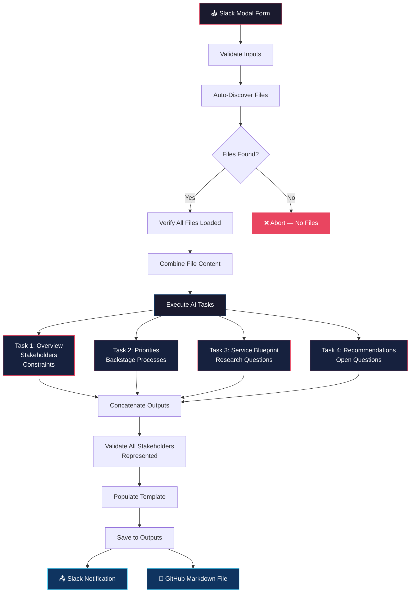
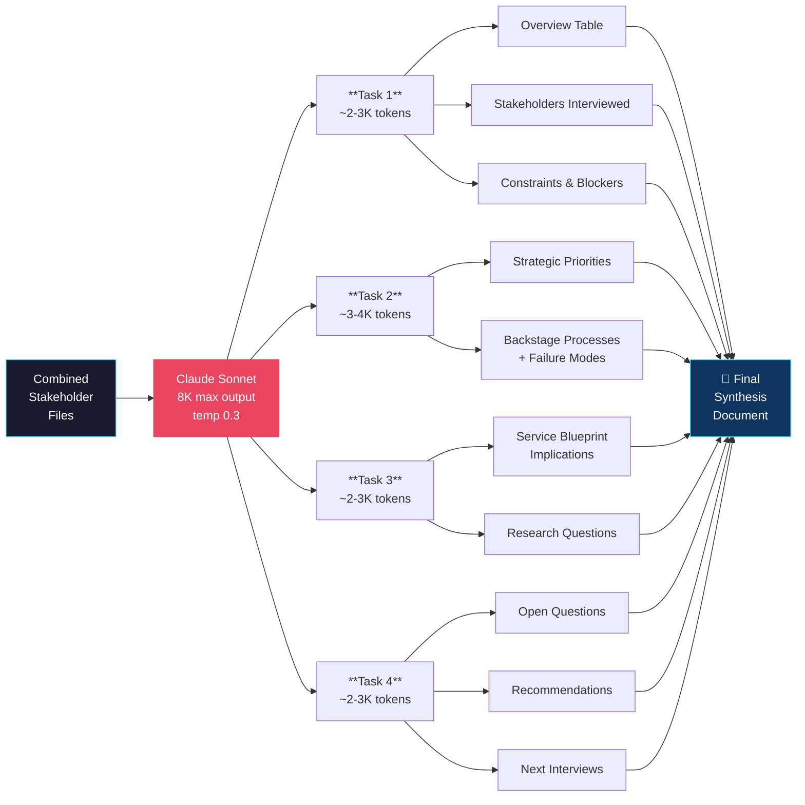
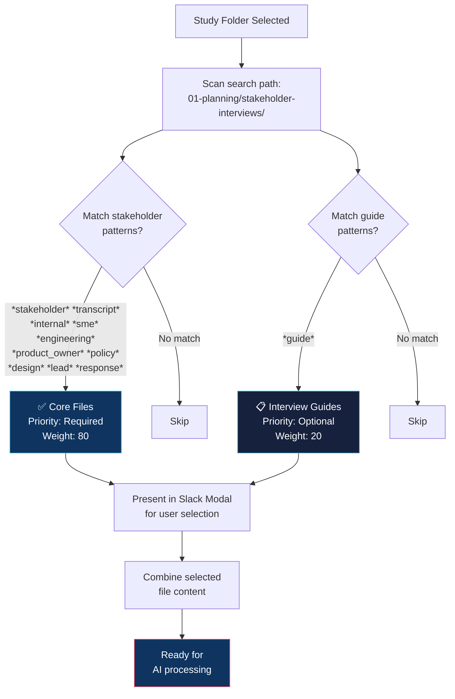
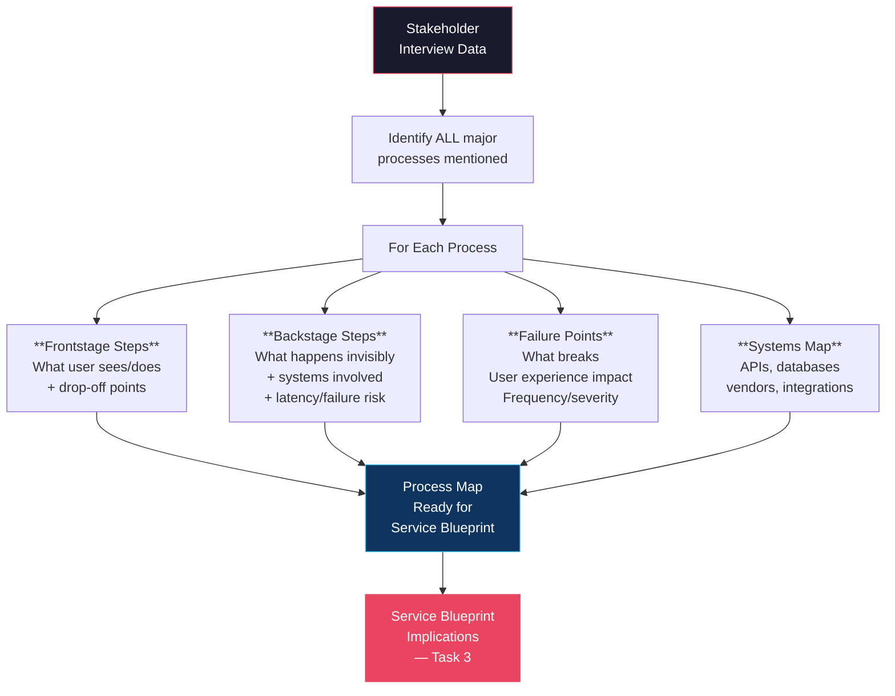
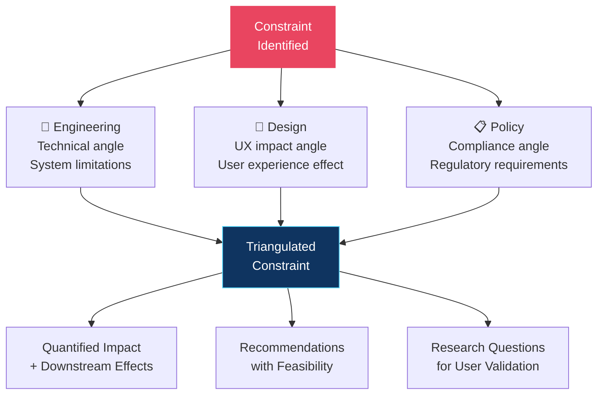
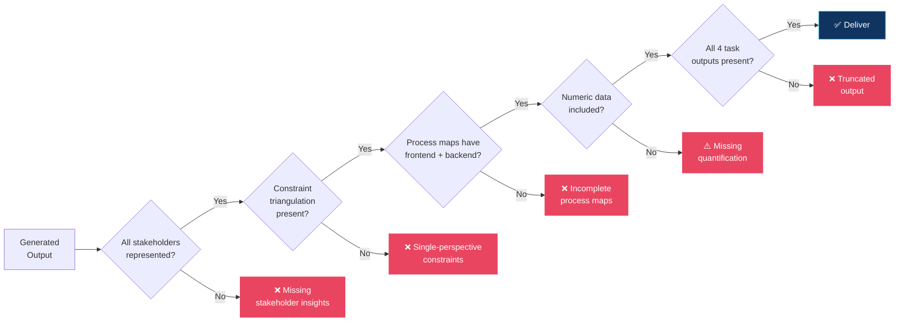
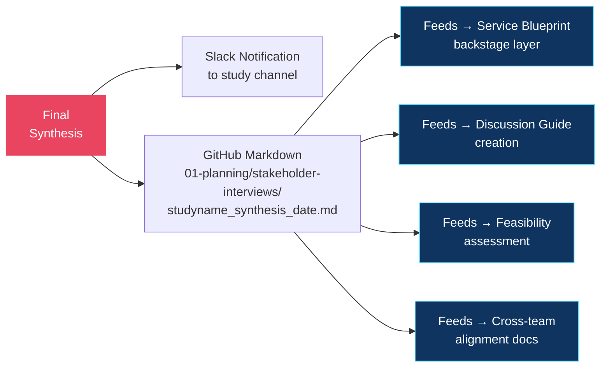

# 🏛️ Stakeholder Synthesis — Architecture & Workflow

> Visual documentation for `stakeholder_synthesis.yaml` v3.0
> Generated: 2026-02-10

---

## Processing Pipeline

How a stakeholder synthesis runs from input to output:

---

## Multi-Task AI Architecture

Why 4 tasks instead of 1 — and what each produces:

---

## File Discovery System

How the auto-discovery finds stakeholder files:

---

## Backstage Process Mapping Flow

How Task 2 maps each process it finds in interview data:

---

## Constraint Triangulation

How the same constraint gets analyzed from multiple stakeholder angles:

---

## Validation Rules

What gets checked before output is delivered:

---

## Output Delivery

Where the final synthesis goes:

---

*Architecture docs for `stakeholder_synthesis.yaml` v3.0 — Qori R&D*
