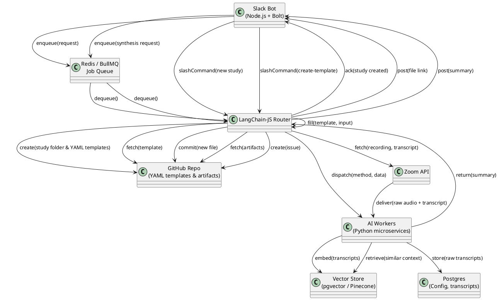

# SPEC-1-Qori-Architecture

## Background

Qori is an AI-enabled Slack bot designed to streamline research operations (researchops) for civic tech user-experience (UX) researchers. By leveraging structured YAML-based files—research method cards (e.g., `affinity_mapping.yaml`, `usability_test.yaml`), research briefs, research plans, discussion guides, and `insights_card.yaml`—Qori enforces standardized workflows across product teams. These YAML templates reside in a GitHub repository, where Qori retrieves and applies them to incoming research requests and artifacts.

Within Slack, researchers can:

- **Start a Study**: Use `/qori new study <folder name>` to initialize a new research project in GitHub, creating the necessary folder structures and instantiating all required YAML templates (briefs, plans, discussion guides, method cards, and `insights_card.yaml`).
- **Instantiate Templates**: Use `/qori create-template-study <template> <input>` to generate a new file from any YAML template (method cards, briefs, plans, discussion guides, `insights_card.yaml`), automatically filling its placeholders with provided inputs.
- **Ingest** research artifacts (interview transcripts, notes, media links) referenced in GitHub.
- **Import Zoom Recordings**: Automatically fetch interview video and transcript via the Zoom API for synthesis.
- **Synthesize** insights through large-language models, using logic defined in the templates’ YAML.
- **Share** structured summaries back in Slack threads and **push synthesized insights** to GitHub issues using `insights_card.yaml`.

Secondary stakeholders—designers, product managers, and developers—then consume these structured outputs directly in their channels or triage them in GitHub issues.

## Requirements

**Must** (M):

- **Slack slash commands** for:
  - `/qori new study <folder name>`: initialize a new research project in GitHub, creating folder structures and instantiating all required YAML templates (briefs, plans, discussion guides, and method cards).
  - `/qori create-template-study <template> <input>`: generate a new file from any YAML template (method cards, briefs, plans, discussion guides), automatically filling its placeholders with provided input.

- **YAML Template Management**: retrieve, parse, and instantiate YAML templates (including `insights_card.yaml`) from GitHub.
- **Artifact Ingestion**: ingest research artifacts (transcripts, notes, media links) referenced in GitHub.
- **Zoom API Integration**: fetch meeting recordings and transcripts for synthesis.
- **LLM-Based Synthesis**: synthesize insights using prompts and logic defined in YAML templates.
- **Output Delivery**: post structured summaries back into Slack threads and push synthesized insights using `insights_card.yaml` to GitHub issues.
- **Authentication & Security**: secure OAuth/token-based authentication for Slack, GitHub, and Zoom; manage secrets via environment variables.

**Should** (S):

- Schedule and post weekly digests of recent insights into designated Slack channels (#research, #ux, etc.).
- Support attachments (images, audio snippets) in Slack posts.
- Provide basic logging and monitoring for job queues and LLM calls.
- Host a full-fledged web UI beyond Slack/GitHub integrations.

**Could** (C):

- Offer a lightweight analytics dashboard (usage metrics, summary counts).
- Allow customization of LLM model choice per team or project.

**Won't** (W):

- Support other chat platforms (Teams, Discord) in MVP.

## Method

Below is the updated high-level architecture for Qori, illustrating how each component interacts to fulfill the Requirements, including Zoom integration, project scaffolding, and template instantiation. The PlantUML diagram captures event flows, services, and data stores:

**Explanation of Components and Flows:**

- **Slack Bot:** Implements slash commands:
  - `/qori new study <folder name>` creates a study folder and instantiates all YAML templates in GitHub.
  - `/qori create-template-study <template> <input>` retrieves a specified YAML template, populates it with input, commits the new file, and posts a link.
  - Other commands enqueue synthesis requests.
- **Redis/BullMQ:** Queues synthesis jobs for reliable, asynchronous processing.
- **LangChain-JS Router:** Central orchestrator:
  - Handles study creation and template instantiation flows.
  - Fetches GitHub templates and artifacts.
  - Invokes the Zoom API to retrieve recordings and transcripts.
  - Dispatches method-specific requests to AI Workers.
- **Zoom API Integration:** Provides raw video/audio and transcripts of Zoom interviews to AI Workers.
- **AI Workers (Python):** Execute:
  - **Transcription Worker:** Ensures Whisper transcription if needed.
  - **LLM Worker:** Uses prompts from YAML to synthesize summaries.
- **Insights Card Handling:** Qori uses an `insights_card.yaml` template to structure synthesized insights. After synthesis, the Router fills this template and commits it to GitHub as part of the issue body, providing a standardized issue card for stakeholders.
- **Storage Layers:**
  - **Postgres:** Persists transcripts, job statuses, and configuration.
  - **Vector Store:** Maintains embeddings for retrieval-augmented generation.
- **Output Delivery:** Router posts structured summaries to Slack and commits GitHub issues using `insights_card.yaml`, closing the loop on researchops.

## Implementation

1. **Infrastructure Setup**:
   - Provision managed Redis and Postgres instances (e.g., AWS ElastiCache, RDS).
   - Set up environment for AI Workers: Docker images with Python 3.10, Whisper v3, and OpenAI SDK.
   - Deploy Node.js Slack Bot and LangChain-JS Router on a container orchestration service (e.g., AWS ECS or Kubernetes).
   - Configure OAuth apps for Slack, GitHub, and Zoom; store credentials in a secrets manager (e.g., AWS Secrets Manager).

2. **Repository and YAML Templates**:
   - Create a mono-repo with folders for `templates/` (YAML files) and `services/` (Slack Bot, Router, Workers).
   - Define schema for templates (placeholders, input formats) and implement a validation library.

3. **Slack Bot & Router**:
   - Implement slash command handlers using `@slack/bolt`.
   - Integrate Redis/BullMQ for job enqueueing.
   - Develop Router modules to fetch and instantiate templates, call Zoom API, and orchestrate AI Workers.

4. **AI Workers**:
   - Build a transcription microservice using Whisper v3.
   - Implement LLM synthesis service with retry logic and prompt templating.
   - Integrate vector store (pgvector extension on Postgres or Pinecone).

5. **CI/CD & Monitoring**:
   - Configure GitHub Actions for building and deploying services.
   - Integrate monitoring and alerting (e.g., Prometheus + Grafana) for job queue lengths, API failures, and latency.

## Milestones

- **M1** (Weeks 1–2): Infrastructure provisioning, repo setup, basic slash commands (`/qori new study`).
- **M2** (Weeks 3–4): Template instantiation flow (`/qori create-template-study`), YAML validation.
- **M3** (Weeks 5–6): Artifact ingestion, Zoom API integration, basic LLM synthesis in Slack.
- **M4** (Week 7): GitHub issue creation, weekly digest scheduling.
- **M5** (Week 8): Monitoring, logging, vector store integration.
- **M6** (Weeks 9–10): Web UI prototype (optional), final testing, and documentation.

## Gathering Results

- Track key metrics: number of studies created, templates instantiated, syntheses completed, and user engagement in Slack.
- Collect feedback from researchers on output quality and workflow improvements.
- Monitor system performance: job queue latency under peak loads, LLM call success rates, and API error rates.

